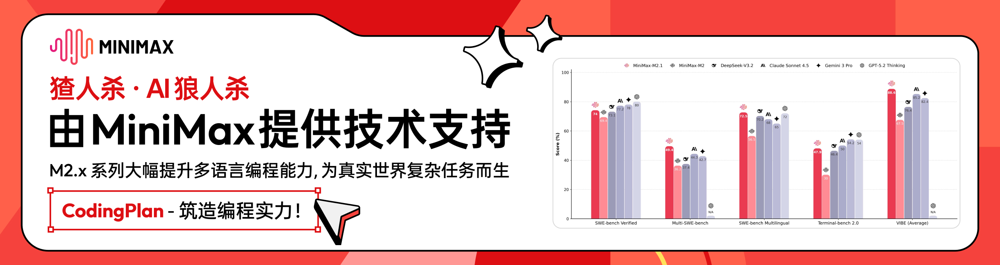

# Wolfcha (猹杀)

<div align="center">
  
  <h3>在狼人杀里，和 AI 赛博斗蛐蛐</h3>
  <p>
    <a href="https://wolf-cha.com">在线体验 (wolf-cha.com)</a>
  </p>
</div>

## 🙏 感谢赞助



现有赞助商：

*   [Zenmux](https://zenmux.ai/invite/DMMBVZ) - 提供 AI 模型能力支持
*   [Minimax](https://platform.minimaxi.com/subscribe/coding-plan?code=I6GrZd4xLt&source=link) - 提供语音与过场音效能力支持
*   [OpenCreator](https://opencreator.io/) - 提供角色立绘生成支持

---

> **Note**: 这是一个诞生于 **「观猹 + 魔搭 环球黑客松」** 的 AI 原生游戏项目。
> 
> "Wolfcha" 这个名字由 Wolf (狼人杀) + Cha (猹) 组成。既是为了致敬黑客松的主办方，取 "Watch" (观察) 之意；同时也呼应了在狼人杀游戏中，我们观察 AI 互动的“吃瓜”心态。

## 📖 项目背景

自从大学毕业后，想要凑齐 8 到 12 个人玩一局完整的狼人杀，变得越来越困难。狼人杀本质上是一个社交游戏，但抛开社交属性，其核心的逻辑推理、话术博弈以及从只言片语中寻找线索的过程，依然非常迷人。

为了让自己随时随地都能体验到狼人杀的乐趣，我们开发了这款 **AI 版本的狼人杀**。顾名思义，除了你自己，其他所有角色（女巫、猎人、守卫、狼人等）都由 AI 扮演。

## ✨ 核心玩法与亮点

### 1. 双层 AI 扮演机制
得益于大语言模型（LLM）日益增长的上下文窗口（Context Window）和指令遵循能力，我们实现了一个复杂的双层扮演系统：
*   **第一层**：AI 扮演一个具有特定性格、背景的“虚拟玩家”。
*   **第二层**：这个“虚拟玩家”在游戏中扮演狼人杀的具体身份（如预言家），并基于游戏局势进行发言、伪装和推理。

每一局的对话都是实时生成的，充满了不确定性和趣味性。

### 2. 大模型赛博斗蛐蛐 (Model Arena)
**这不仅是狼人杀，更是一场模型能力的竞技场。**

我们在游戏中接入了多款大模型，让它们同台竞技。游戏结束后，你可以看到每个角色背后对应的模型。这是一场隐藏的“图灵测试”——你可以观察在这个复杂的博弈场景中，哪个模型逻辑严密，哪个模型表现得“蠢萌”，又是哪个模型说话最有人味儿。

当前内置模型（以项目内配置为准）：
*   **DeepSeek V3.2**
*   **Qwen3-235B-A22B**
*   **Kimi K2**
*   **Qwen3-Max**
*   **Seed 1.6 (ByteDance)**

<div align="center">
  
  
  
  <br/>
  
</div>

### 3. 沉浸式复古体验
虽然没有专业的美术团队，但我们通过精心的 UI/UX 设计提升了游戏体验：
*   **复古设计风格**：清爽的排版与复古色调。
*   **动态交互细节**：
    *   天黑/天亮时的眨眼转场效果。
    *   角色发言时，嘴巴会随语音节奏张合。
    *   神职角色发言时配有专属立绘。
*   **多模态体验**：利用 **Minimax** 实时生成不同音色的语音，让每个角色都“活”起来。

## 🧭 后续计划

我们还会继续打磨这些方向：
*   **移动端适配**：让大家随时爽玩。
*   **人数自由选择**：支持 8-12 人自定义人数开局。
*   **结束后的复盘 / 闲聊**：沉淀一局中的思路与段子。
*   **特色技能系统**：如时间回溯、AI 洞察等狼人杀特色玩法。
*   **自定义参与模型**：选择你想上场的大模型。
*   **联机模式**：可以和朋友一起跟 AI 玩狼人杀。
*   **人物点赞**：为表现出色的性格/模型点赞，看到最会玩狼人杀的大模型。

## 🛠️ 技术栈

本项目基于现代 Web 技术栈构建：

*   **Framework**: [Next.js 16](https://nextjs.org/) (App Router)
*   **Language**: [TypeScript](https://www.typescriptlang.org/)
*   **Styling**: [Tailwind CSS 4](https://tailwindcss.com/)
*   **UI Components**: [Radix UI](https://www.radix-ui.com/), [Lucide React](https://lucide.dev/)
*   **State Management**: [Jotai](https://jotai.org/) 
*   **Editor**: [Tiptap](https://tiptap.dev/) (For rich text interactions)
*   **Animations**: [Framer Motion](https://www.framer.com/motion/)
*   **Avatar Generation**: [DiceBear](https://www.dicebear.com/) (Notionists style)
*   **AI Integration**: [Zenmux](https://zenmux.ai/invite/DMMBVZ) (Unified interface for LLMs)
*   **TTS**: [Minimax](https://platform.minimaxi.com/subscribe/coding-plan?code=I6GrZd4xLt&source=link)

## 🚀 本地运行

如果你想在本地运行本项目：

1.  **克隆仓库**

```bash
git clone https://github.com/oil-oil/wolfcha.git
cd wolfcha
```

2.  **安装依赖**

```bash
# Using pnpm (recommended)
pnpm install

# Or using npm
npm install
```

3.  **配置环境变量**

你需要配置相应的 API Keys (OpenRouter, Minimax 等) 才能运行完整功能。请参考 `.env.example` (如果有) 或自行创建 `.env.local`。

4.  **启动开发服务器**

```bash
pnpm dev
```

打开浏览器访问 [http://localhost:3000](http://localhost:3000) 即可看到效果。

## 📄 License

MIT
